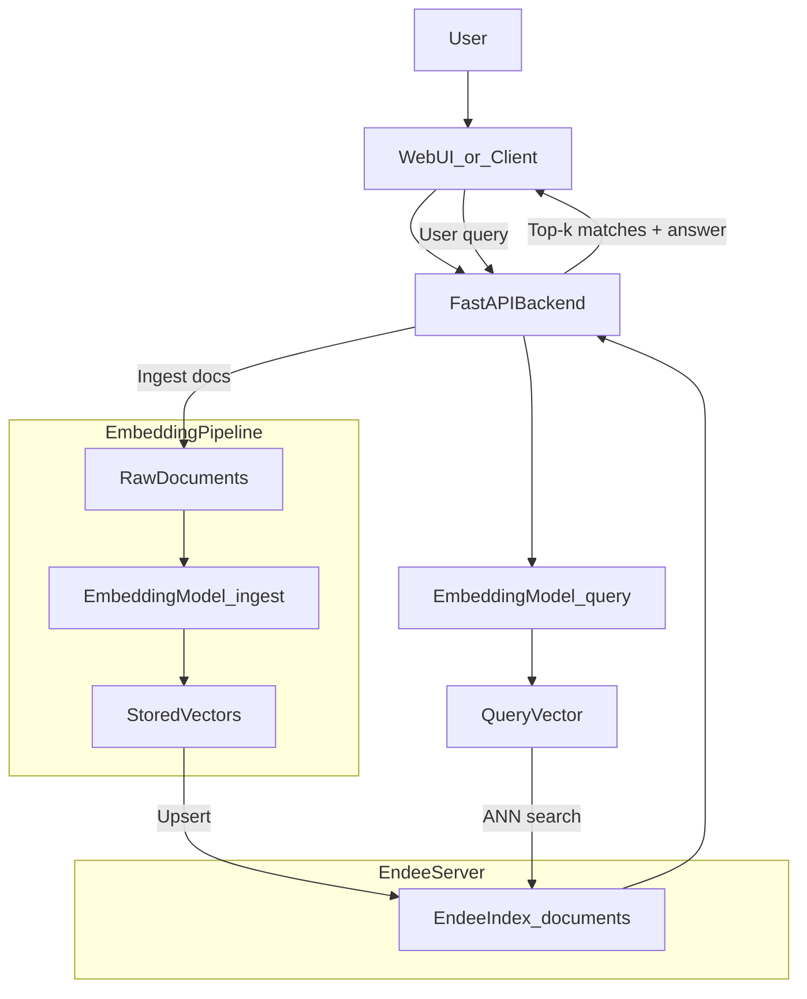

# RAG Semantic Search

A document Q&A and semantic search application powered by the [Endee](https://github.com/endee-io/endee) vector database. This project demonstrates how to build a retrieval-augmented generation (RAG) pipeline using Endee for fast, accurate vector similarity search.

## Project Overview & Problem Statement

**Problem**: Traditional keyword search fails when users ask questions in natural language or when relevant documents use different wording. Users need to find documents by *meaning*, not just exact text matches.

**Solution**: This project implements semantic search over a document corpus. Documents are converted into dense vector embeddings and stored in Endee. Queries are embedded the same way, and Endee returns the most semantically similar documents via approximate nearest neighbor (ANN) search. The result is a search experience that understands intent and context.

## System Design & Technical Approach

### Architecture



### Components

| Component | Description |
|-----------|-------------|
| **FastAPI Backend** | REST API with `/ingest` and `/query` endpoints. Handles embedding generation and Endee communication. |
| **SentenceTransformers** | `all-MiniLM-L6-v2` model for 384-dimensional embeddings. Runs locally, no API keys required. |
| **Endee** | Vector database storing document embeddings. Handles upsert and ANN search. |
| **Frontend** | Simple HTML/JS UI for submitting queries and viewing results. |

### Data Flow

1. **Ingestion**: Documents (text + metadata) are embedded via SentenceTransformers, then upserted into Endee with unique IDs and metadata.
2. **Query**: User query text is embedded, then Endee performs top-k similarity search. Results include document IDs, similarity scores, and metadata.

## How Endee Is Used

### Index Configuration

- **Name**: `documents` (configurable via `ENDEE_INDEX_NAME`)
- **Dimension**: 384 (matches `all-MiniLM-L6-v2` output)
- **Space type**: `cosine` (cosine similarity)
- **Precision**: `INT8` (quantization for speed/memory trade-off)

### Ingestion Pattern

Documents are upserted with:

- `id`: Unique string identifier (e.g., filename without extension)
- `vector`: 384-dimensional embedding from the text
- `meta`: Optional metadata (title, source file, etc.) for display and filtering

### Query Pattern

- Query text is embedded with the same model.
- `index.query(vector=..., top_k=5)` returns the top-k most similar documents.
- Results include `id`, `similarity`, and `meta` for each hit.

### Authentication

By default, Endee runs without authentication (`NDD_AUTH_TOKEN=""`). To enable token-based auth, set `NDD_AUTH_TOKEN` in the Endee container and `ENDEE_AUTH_TOKEN` when initializing the Python client.

## Setup & Execution Instructions

### Prerequisites

- [Docker](https://docs.docker.com/get-docker/) and [Docker Compose](https://docs.docker.com/compose/install/)
- Python 3.10+
- Ports 8080 (Endee) and 8000 (backend) available

### Step 1: Start Endee

From the `examples/rag-search` directory:

```bash
docker compose up -d
```

Verify Endee is running: open [http://localhost:8080](http://localhost:8080) for the dashboard.

### Step 2: Set Up Python Environment

```bash
cd backend
python -m venv venv
# Windows:
venv\Scripts\activate
# Linux/macOS:
# source venv/bin/activate

pip install -r requirements.txt
```

### Step 3: Run the Backend

From the `backend` directory:

```bash
uvicorn app.main:app --host 0.0.0.0 --port 8000
```

Or:

```bash
python -m app.main
```

### Step 4: Ingest Example Documents

In a new terminal, from the project root:

```bash
pip install requests  # if not already installed
python scripts/ingest_docs.py
```

### Step 5: Query

- **Web UI**: Open [http://localhost:8000](http://localhost:8000) and use the search form.
- **API**: Use the examples below.

## Example API Requests

### Health Check

```bash
curl http://localhost:8000/health
```

### Ingest Documents

```bash
curl -X POST http://localhost:8000/ingest \
  -H "Content-Type: application/json" \
  -d '{
    "documents": [
      {"id": "doc1", "text": "Machine learning enables systems to learn from data.", "meta": {"title": "ML Intro"}},
      {"id": "doc2", "text": "Vector databases store embeddings for similarity search.", "meta": {"title": "Vector DBs"}}
    ]
  }'
```

### Query

```bash
curl -X POST http://localhost:8000/query \
  -H "Content-Type: application/json" \
  -d '{"query_text": "How does AI learn from data?", "top_k": 5}'
```

## Testing and Validation

After ingesting documents, verify the setup:

1. Query for a known topic, e.g. `"How does machine learning work?"` — the `machine-learning` document should appear in the top results.
2. Query `"What is RAG?"` — the `rag-overview` document should rank highly.
3. Check the Endee dashboard at http://localhost:8080 for index statistics and query metrics.

## Project Structure

```
examples/rag-search/
├── backend/
│   ├── app/
│   │   ├── config.py      # Configuration
│   │   ├── endee_client.py # Endee SDK wrapper
│   │   ├── embeddings.py   # SentenceTransformers helpers
│   │   └── main.py        # FastAPI app
│   └── requirements.txt
├── data/
│   └── docs/              # Example documents to index
├── frontend/
│   └── index.html         # Search UI
├── scripts/
│   └── ingest_docs.py     # Bulk ingestion script
├── docker-compose.yml     # Endee service
└── README.md
```

## Environment Variables

| Variable | Description | Default |
|----------|-------------|---------|
| `ENDEE_BASE_URL` | Endee API base URL | `http://localhost:8080/api/v1` |
| `ENDEE_AUTH_TOKEN` | Endee auth token (optional) | `""` |
| `ENDEE_INDEX_NAME` | Index name | `documents` |
| `EMBEDDING_MODEL` | SentenceTransformers model | `sentence-transformers/all-MiniLM-L6-v2` |
| `EMBEDDING_DIM` | Vector dimension | `384` |
| `API_HOST` | Backend bind host | `0.0.0.0` |
| `API_PORT` | Backend port | `8000` |

## License

This example is provided under the same license as the Endee project (Apache 2.0).
